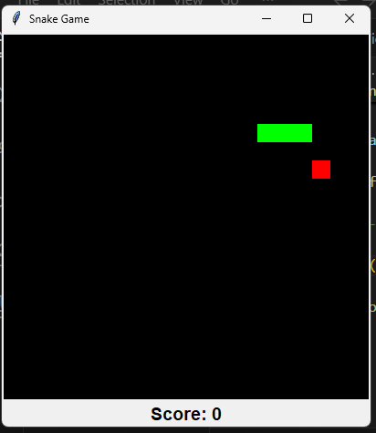

# Snake Game (Python + Tkinter)

A classic Snake Game built using Python and Tkinter with grid-based movement, score tracking, food spawning, and collision detection.

## Features

- Smooth grid-based snake movement
- Random food spawning
- Score tracking
- Wall collision detection
- Self collision detection
- Game over system
- Keyboard controls

## Tech Stack

- Python
- Tkinter

## Controls

| Key | Action |
|-----|--------|
| ↑ | Move Up |
| ↓ | Move Down |
| ← | Move Left |
| → | Move Right |

## Preview

